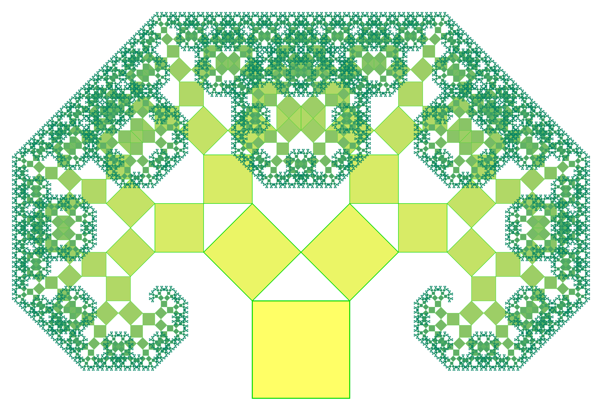
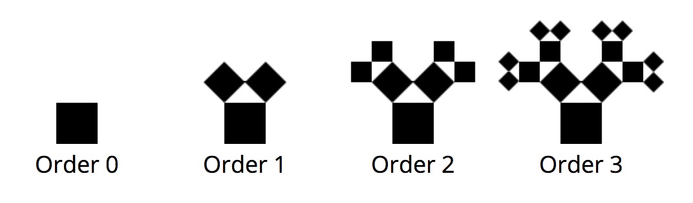

As this is the first Weekly Challenge I thought it would be fun do to a Pythagoras Tree.

The construction of the tree begins with a square. Upon this square are another two squares  constructed. Each of these squares scaled down by a linear factor of ½√2, such that the corners of the squares coincide pairwise. This is applied recursively to the two smaller squares.
This image shows the first three iterations.

The challenge is to implement this as efficient as you can. The only requirement is that is must be using Javascript.
I prepared a [Codepen](http://codepen.io/DailyJavascript/pen/MKyjoN#0) template with some defaults so you can start coding right away.
Do not feel limited to this pen or to the setup. This is to challenge yourself so if the 2d context is to simple for you check out this [Codepen](http://codepen.io/DailyJavascript/pen/LGNxZv) for a 3D template.

The most amazing implementations will be posted next Friday along with the next challenge so make sure you finish by then.
